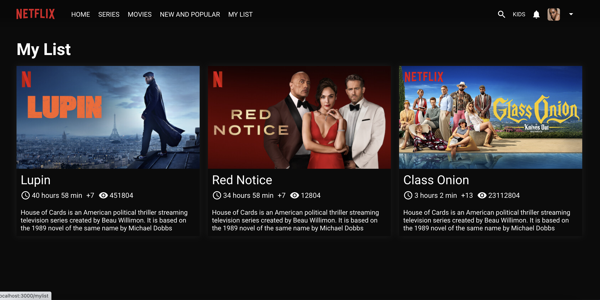

Version one (without firebase) branch main
1. npm install
2. cd server
3. node index.js

The second version with firebase is on the branch
feature/firebase-auth

<h1>Register Page</h1>

<h1>Login Page</h1>

<h1>Home Page</h1>

<h1>Film Slider</h1>

<h1>Trailer Video</h1>

<h1>My List</h1>

<h1>Player</h1>

